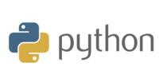

# Peace of Mind - Backend

The back end portion of Peace of Mind, powered by python and the muse developer kit.

## Getting Started

These instructions will get you a copy of the project up and running on your local machine for development and testing purposes. See deployment for notes on how to deploy the project on a live system.

### Installing

Install the following libraries

```
pip install muselsl
```

## Deployment


## Built With

* [Python](https://www.python.org/) - General purpose server side language used

* [Firebase](https://firebase.com) - Realtime database created by Google

* [Muse LSL](https://github.com/alexandrebarachant/muse-lsl) - Open source library to interpret EEG data from muse 2


## Authors

* **Michael Lai**
* **Steven Han**
* **Zach Markey**
